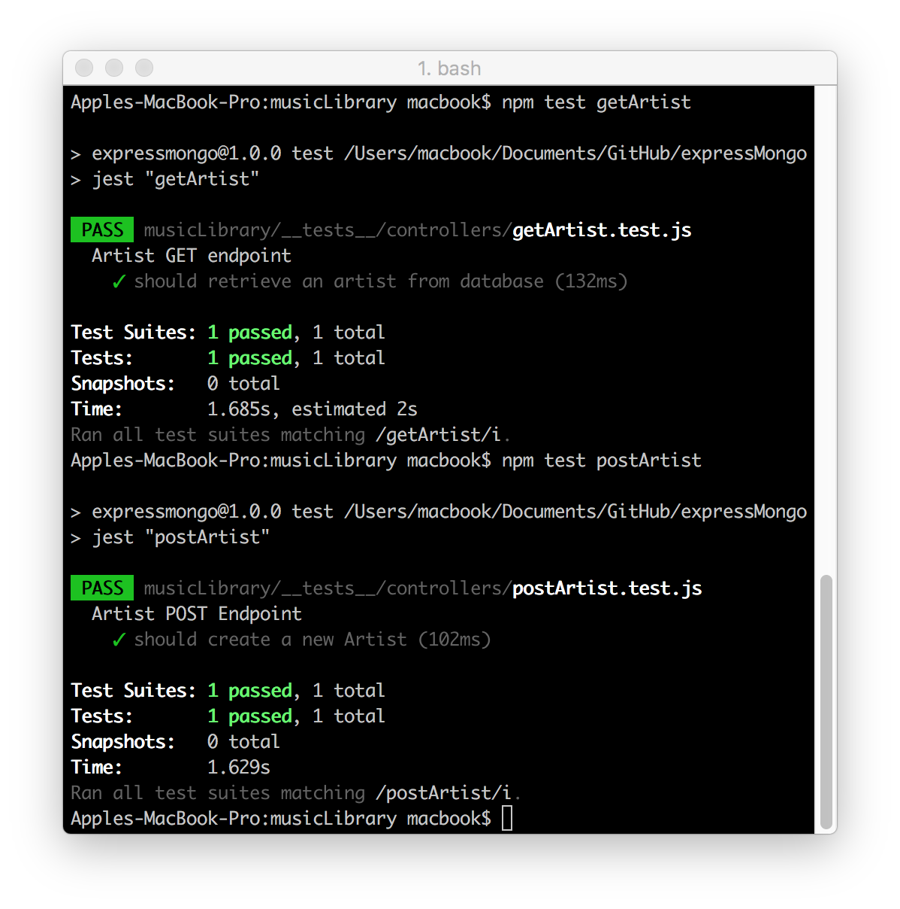
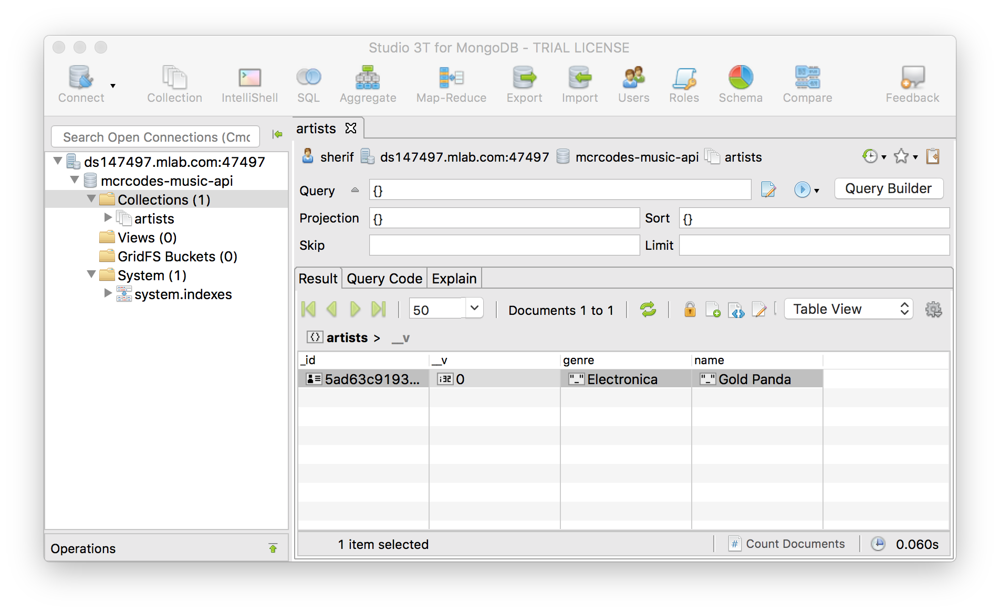
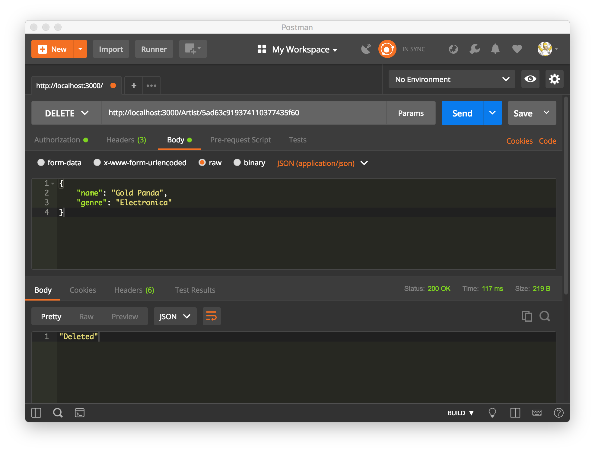
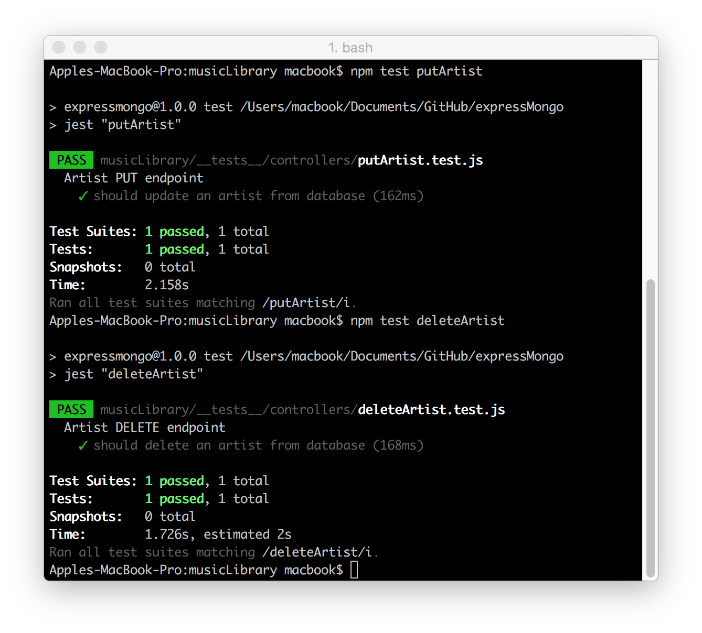
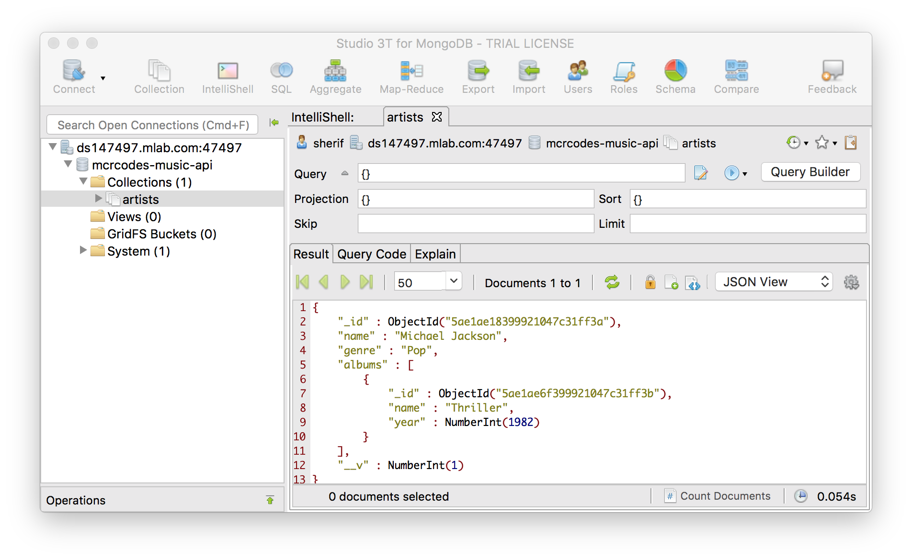

## Music Library API - Databases / Database Design / MongoDb
Brief overview into databases and database design, followed by a deep dive into MongoDb (a NoSQL database). Building a Music Library API, it will store information about artists, albums and songs, using a hosted database provider called Mlab. They offer a free tier solution where a MongoDb database can be created and use it with Express API. Once Mlab account and a MongoDb database set-up, implement a CRUD REST API to interact with a MongoDb database.

#### Built with:
* [npm](https://www.npmjs.com/) - Node Package Manager
* [Jest](https://facebook.github.io/jest/) - JavaScript Testing Framework
* [Express](https://expressjs.com/) - Server-side JavaScript Framework
* [MongaDB](https://www.mongodb.com/) - Document-oriented Database Program
* [Postman](https://www.getpostman.com/) - Tool for Testing API
* [mLab](https://mlab.com/) - Managed MongoDB Hosting
* [Dotenv](https://github.com/motdotla/dotenv) - Loads Environment Variables

#### Testing the GET/POST handler with Jest

#### Testing the PUT handler with MongaDB

#### Testing the DELETE handler with Postman

#### Testing the PUT/DELETE handler with Jest

#### Testing Nested Documents with the POST handler
